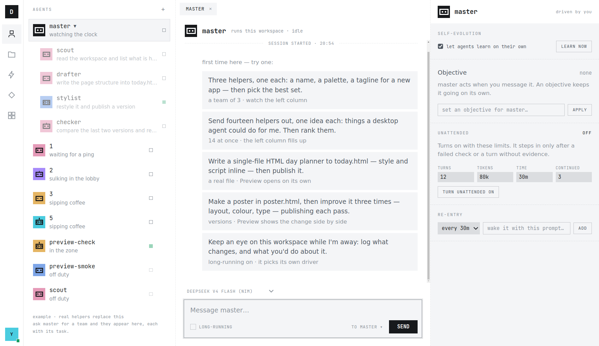

<div align="center">

# AOE

**A**gents · **O**bjectives · **E**volution

把活交出去、然后走开的桌面工作台。

[中文](README.zh-CN.md) · [English](README.md)

[](LICENSE)
[](#快速开始)
[](https://github.com/PrimeIntellect-ai/prime-agent)

[快速开始](#快速开始) · [Agents](#agents) · [Objectives](#objectives) · [Evolution](#evolution) · [它是怎么搭的](#它是怎么搭的) · [现在到哪一步了](#现在到哪一步了)

<picture>
  <source media="(prefers-color-scheme: dark)" srcset="assets/hero-dark.png">
  
</picture>

<sub>刚打开时的一个工作区——左边是这队人，中间是 master 提出可以做的事，右边是推着它走的东西。</sub>

</div>

## 这是什么

每个工作区里住着一个常驻智能体，叫 **master**。你告诉它要什么，它派一队助手去做，你不在的
时候它自己接着推进，做完在磁盘上留下真实的文件，并把这一趟学到的东西存回自己身上。机器上
任何一个智能体，你都能打开看它在干嘛，也能直接跟它说话。

它面向那种你宁可回头查看、而不是全程盯着的活：一批要比较的方案、一份要改五遍的文档、一件
你出门时想让人盯着的事。它不是 IDE，也不是结对编程搭子——没有编辑器、不接 git、不跑测试。
最后交回给你的，是一个目录里的文件，加上它们是怎么变成这样的记录。

它整个跑在本地：Electron 客户端 + 本机的 [prime-agent](https://github.com/PrimeIntellect-ai/prime-agent)
守护进程，后者带一个常驻 Python kernel。会话、文件，以及 harness 状态——智能体那份可变的
提示词与记忆，区别于它不可变的基础提示词——都不出这台机器；会出去的只有模型调用和一个网页字体。

整个界面只守一条规矩：

> **界面上的状态一律读自运行时，绝不采信模型自己的说法。**
> 面板说某个目标在跑，那是守护进程说的。

智能体说「做完了」，那只是一句主张。能并排 diff 的版本、对着预算跳动的用量、附着证据的一条
经验、守护进程还认得的一个助手，才是事实。

名字就是这扇窗口的三样东西，也是下面三节：你派出去的 agents、让它们在你不在时继续跑的
objectives、以及事后被它们留下来的 evolution。项目还早——没有发布二进制，得自己从源码构建，
[现在到哪一步了](#现在到哪一步了)写清了还差什么。

## 快速开始

**先进去看一眼**，大概两分钟。不碰运行时、不起守护进程：真正的界面壳子跑纯模型对话，只是没有
那队人、没有长程驱动、也没有自进化。

```sh
git clone https://github.com/shitianfang/aoe && cd aoe
npm install
cp .env.example .env   # 一个 NVIDIA NIM key —— https://build.nvidia.com
npm run dev            # 渲染层，http://localhost:3000
npm run app            # Electron 外壳，另开一个终端
```

**要真家伙**，就需要 **Node ≥ 22.8** 和 **[uv](https://docs.astral.sh/uv/)** 在 PATH 上——守护
进程和它的 Python kernel 靠这两样。开发主场是 Linux 和 macOS，Windows 的情况见
[现在到哪一步了](#现在到哪一步了)。

```sh
npm run core:install   # 智能体运行时，随仓库 vendored 在 core/
npm run core:build     # 构建一次，bridge 直接加载它的 dist
```

先给运行时配一个模型。供应商配置是 prime-agent 自己那份，放在 `~/.prime/agent/`，客户端读的
就是那里：Anthropic、OpenAI、Google、OpenRouter、Groq、DeepSeek、Prime Inference 等二十多家
是内置的，另外任何 OpenAI 兼容的端点都能加——本项目自己用的是 NVIDIA NIM。

```sh
./core/prime-agent.sh   # 进去后 /login，挑一个订阅或 API key 供应商
```

然后三个进程，各开一个终端，三个都得一直开着：

```sh
npm run bridge         # 夹在应用和守护进程之间的那个 Node 进程，127.0.0.1:3117
npm run dev            # 渲染层，http://localhost:3000
npm run app            # Electron 外壳
```

`npm run bridge` 会顺带把守护进程拉起来。界面默认中文，切英文在左下角头像里。首次打开不是一个
空输入框，而是几条可以直接发的示例。发一条试试——比如*「三个助手，一人一样：名字、配色、
slogan，然后挑出最好的一组」*——看着左边那列填满。

> [!WARNING]
> 运行时会用你的用户权限执行模型生成的 Python，而自动运行这个模式的存在意义，恰恰就是让它别
> 停下来问你。worker 与 kernel 进程带来的是生命周期隔离，**不是**安全沙箱。把工作区指向一个丢了
> 也没关系的目录，别把不可信的指令、技能、扩展放进去。
> bridge 只绑 `127.0.0.1`，但不校验来源；`npm run dev` 又把渲染层开在 `0.0.0.0` 上——也就是说，
> 任何能碰到 3117 端口的东西都能驱动你的智能体。只在可信网络里用。
>
> 想让它停下来：智能体干活时，发送按钮会变成**停止**，按下即中止本轮。关掉应用不行——worker 是
> 常驻的，照跑不误。清掉目标、或把自动运行关掉，它才不会再自己续上；`pkill -f prime-agent`
> 则是全部结束。

不太对劲的时候：

| 现象 | 原因 | 怎么办 |
| --- | --- | --- |
| 设置里显示*仅模型*，没有队伍也没有驱动 | bridge 没起来，或者守护进程没能启动 | 看跑 `npm run bridge` 那个终端，它会讲是哪一种 |
| 守护进程一启动就死，或者一个助手都派不出去 | 缺 `uv`，或者 Node 低于 22.8 | 装 [uv](https://docs.astral.sh/uv/)；在 bridge 那个终端里 `node -v` |
| 3117 端口 `EADDRINUSE` | 有个旧 bridge 还活着 | `pkill -f "electron/bridge[.]mjs"`，然后重新起 |
| 输入框上没有模型选择器 | 还没配任何供应商 | `./core/prime-agent.sh`，然后 `/login` |

## Agents · 一队人，不是一个聊天框

- **master 是常驻的**，一个工作区一个。它派助手去做并行或后台的活；而且守护进程上不止它一个：
  左列同时列出 master、它的助手、机器上其它每个 **root**（自己独立的顶层会话，不是谁派生出来的），
  以及那些 root 自己的队伍。
- **每一行都说这个智能体在干什么**：优先是它自己写下的当前这一步，没有就退回派给它的任务；
  旁边的状态和完成时刻则是守护进程报的。两样都没有的，会给一句按状态取的固定俏皮话，所以不会
  有空行。队伍行数三个数：几个在跑、几个等你、几个失败了。
- **任何活着的会话都能开成一个 tab**：完整对话，流式，工具行写清楚到底动了哪个文件、跑的第一行
  代码是什么。重新接上时，早前的轮次折成一行「更早的 N 轮 · 展开」，而不是把历史一股脑砸给你。
- **想跟谁说话就跟谁说**——用输入框的 `to` 选择器，或者直接用那个智能体自己那一屏的输入框。发给
  助手会回执「已送达」或「已排队」；空闲的 root 会被叫醒；正在跑的 root 是被插话引导。
- **助手面板就说助手是什么**：它的任务、状态、完成时刻、派生时定下的模型（定死了，所以只显示、
  不给切）、它花掉并计入 master 预算的 token，以及它是否还联系得上、还是当场跑完就没了。助手
  没有自己的目标、自动运行和定时跟进，面板就把那几行留空不写，而不是给它编一个。
- 可以停掉或移除一个助手；root 智能体也能直接在这列里新建、删除。

## Objectives · 让活自己接着跑

输入框上只有一个开关：**长程自主**。打开它本身什么也不启动，它只是在你下一条消息前面加上一段
明确的要求——装上**恰好一样**驱动方式（决定这个智能体下一次何时行动的运行时机制），并用一句话
说清楚挑了哪个、为什么：

| 驱动方式 | 智能体实际调用 | 适合 |
| --- | --- | --- |
| **目标** | `goal.create(objective, token_budget=…)` | 要跨很多轮一直追到达成的活——你不指定时，那段要求里写的是 40 万 token |
| **定时跟进** | `rlm_heartbeat.create(instruction, interval=…)` | 该按节奏回来看一眼、而不是一直跑的活（运行时管这个叫 heartbeat） |
| **自动运行** | `autonomous.enable(turns=…, tokens=…, time=…, continuations=…)` | 一件长任务，不能一遇到含糊就停 |

客户端不替你选，也绝不背着你打开任何一样。是智能体自己决定、自己说出口，它装上的东西随后会
自己出现在右边的面板里。你的时间线上留的是你自己的原话，外加一行「已请它自行安排驱动方式」的
注记——那段前缀绝不会被冒充成你打的字。这个开关按智能体、按会话生效，重启后不会自己悄悄回来。

右边的检查面板既是「谁在推进它」的记录，也是你手动接管的地方：

- **目标**——目标本身、状态、用量对预算的百分比；可暂停、继续、清除，也可以直接在这里设一个。
  顶部主语行写着*由你推进*或*目标推进中*。
- **自动运行**——续跑次数、轮数、用量、已用时长各自对着上限，以及上一次续跑是为什么被注入的。
  实际上这个原因永远是*某轮结束时没有交付证据*：另一种「检查失败」需要 gate 命令，而那只有在
  启动守护进程时带上才有。上限在开启前可改，预填运行时的默认值：12 轮、80k 用量、30 分钟、
  3 次续跑。
- **自动唤醒**——上面那些定时跟进，加上排期作业，带下次触发时间，可暂停、继续、取消。新建一条
  就是选个间隔加一句大白话指令，不用学 cron 语法——当然也就没有 cron 的表达力。

目标、自动运行、定时跟进都绑定当前选中的那个智能体；某个 root 的状态还在路上时，面板会如实说
正在读取，而不是谎称它没有目标。有两样东西刻意不按智能体分，界面上也这么标着：排期作业是
master 的，下面那个自动学习开关是整台机器的。

## Evolution · 学到的东西留得下来

一条经验，是运行时的**复盘器**——它自己对这段轨迹的复查，不是另一个智能体——认为有东西值得留下
时写下的：对这个智能体的 harness 状态（补充提示词、记忆、技能与子代理描述）做一点小的、带证据
的修改。不可变的基础提示词永远不动。这是 prime-agent 的持续 harness，在这里被端成了你能读、
能撤、能推广的产品功能。

- **学习一次**：对选中智能体自己的会话和 harness 跑一次复盘，可以附一句你希望它重点看什么。要跑
  几分钟；跑完那条经验会自己在自进化列里多出一行——如果是 master，还会当场以卡片形式落到时间线。
- **自动学习**是一个开关，管整台机器：所有智能体、所有工作区。它写的就是运行时自己那份全局设置，
  bridge 随即重载每个活着的 worker，让改动当场生效。面板交代节奏：上一次自动复盘发生在什么时候，
  下一次最早什么时候能发生。
- **自进化列**（左侧导轨的闪电图标）把所有留下来的经验汇成两组：*某个智能体的*——master 的和每个
  root 的按时间交错排在一起，每行标着归属；以及*所有工作区通用的*。你上次看过之后又有新的，导轨上
  会亮一个点。
- **点开一条经验能看到整份记录**：摘要、harness 自己给出的保留理由、它预期会改变什么（这是复盘器
  的说法，系统并不验证）、实际落下的修改、作用范围，以及来源——自动、你要求的，还是它自己起意。
  在时间线上当场接住的那张卡片还多一样：每处修改的前后对照。

两个操作。**回滚**一步撤销一条经验，这次回滚本身也会被记成一条经验，而这一条，列表不会再给你
回滚按钮。**推广到所有工作区**以那条经验的摘要为种子，在全局范围重跑一次复盘——产出的是一条**新**
经验，对这台机器上的每个会话生效，结论也可以和本地那条不一样。

## 文件与预览

运行时唯一的工具是 Python REPL，所以写文件发生在 kernel 里面，任何工具参数都不能当作「改了什么」
的凭据。于是 bridge 在每轮结束时扫描工作区，和上一份清单做 diff。文件列就是这个 diff，外加智能体
显式发布的东西：什么变了、谁改的、什么时候。扫描最深只走四层，且跳过点开头的目录，所以写到
`.out/report.html` 的文件不会出现在列表里。

预览能打开 `.html`（沙箱 iframe 里）、`.md`、`.png`、`.pdf`。每一轮只要文件内容真的变了就快照一个
版本，视图把最近两版并排放，下面列出这两版之间发生的工具调用和经验。智能体也可以显式声明一件
工作成果，那会立刻以它自己的名义快照一版。快照按路径 + 内容哈希去重，同一轮里既被声明、又被扫描
发现的文件仍然只是一个版本。快照是实打实的文件，存在 `~/.prime/desktop/.previews/` 下，没有任何
清理机制——一个改了一整天的页面，会留下每轮一份副本。

## 这里的规矩

这个客户端对「活该怎么干」并不中立。AOE 建的每个会话都会被追加
一段系统提示词——是追加，永远不替换运行时自己那份——告诉智能体：这个工作区会即时渲染它写下的
东西；凡是有形状的东西（页面、排版、文档、方案），先写三个**真正不同**的版本让人挑，别用形容词
问偏好；边做边写文件，让每轮结束都刷新预览；永远不要起 web server，也不要让用户自己去开浏览器；
成品用 `preview.publish(path, label=…)` 发布；每轮结束讲清楚改了什么、下一步是什么。

展开的长版本是本仓库里的一个技能：[`skills/aoe-way`](skills/aoe-way/SKILL.md)，bridge 会把它和
运行时自带的技能一起交给守护进程。里面写着变体规则、给候选做**盲评**的子代理评审流程，以及该
汇报什么才能让你去核对、而不是去相信。改它，你工作区里的智能体干活方式就跟着变。

## 这个工作台本身

`~/.prime/desktop/` 下每个目录就是一个工作区，各有自己的常驻 master，`general` 是置顶的默认工作区。
导轨上的 logo 用来切换和新建，并显示哪些 master 在跑。下次打开停在你上次待的那个。

- **中间最多四屏，2×2 网格，每屏一组 tab。** 把 tab——或者直接把左列的一个智能体——拖过某一屏的
  边缘就在那里分屏，拖到中间则是加成一个 tab。每屏有自己的输入框，绑定它当前显示的对象，整套布局
  按工作区保存。
- **中英文、亮暗色**都在左下角头像里切。智能体的回复按 Markdown 渲染，流式写到一半的也渲染。
- **技能和扩展**是只读目录，列出运行时实际拥有的东西：技能、模型供应商、MCP server、扩展。

## 它是怎么搭的

```
┌──────────────────────────────────────────────────────────────────┐
│  渲染层 — Electron 里的 React，没有状态框架                        │
│  智能体 · 时间线 · 检查面板 · 自进化 · 文件 · 预览                  │
└───────────────────────────────┬──────────────────────────────────┘
                                │  HTTP + SSE，127.0.0.1:3117
┌───────────────────────────────▼──────────────────────────────────┐
│  bridge — electron/bridge.mjs（Node）                            │
│  工作区 · 接管与引导 · 每轮结束的文件 diff · 版本快照               │
└───────────────────────────────┬──────────────────────────────────┘
                                │  daemon protocol v7，JSONL over
                                │  unix socket（Windows 上是命名管道）
┌───────────────────────────────▼──────────────────────────────────┐
│  prime-agent 守护进程 — core/                                     │
│  supervisor ─▶ 每个 root 会话一个 worker ─▶ Python kernel         │
└──────────────────────────────────────────────────────────────────┘
```

bridge 存在有两个理由。渲染层开不了 unix socket；而 prime-agent 的启动路径会把协议版本、schema id、
应用版本三者中任一与自己不同的守护进程判为过期并替换掉——所以跟守护进程说话的 SDK，必须就是同一份
构建。于是由一个 Node 进程独占这条连接、持有所有 attach，再把事件以 SSE 扇出去。客户端断开不会停掉
worker：关掉应用，那队人照跑。

## 模型

运行时连着的时候，输入框上的选择器切换的是你当前正在对话的那个会话的模型，候选来自
`~/.prime/agent/` 里配好的供应商。master 只对自己那份负责，每个 root 也一样。助手没有选择器，因为
助手的模型在 master 派生它的那一刻就定了。

运行时不在时，应用退化成纯模型对话，而不是罢工：

- **Claude Code**——bridge 在工作区目录下跑 `claude -p`，带 `--permission-mode acceptEdits`，放开
  Bash、WebSearch、WebFetch，按 session id 续接，并把它的工具活动和子代理流回时间线。AOE 自己不添
  任何凭据：子进程继承你的环境变量，用的就是你机器上已有的那份登录。整个应用共用一个会话；这条路
  需要 bridge（它是一条 bridge 路由，NIM 那条不是），并且在 Windows 上跑不通。
- **NVIDIA NIM**——`.env` 里的 `NIM_API_KEY`，在服务端代理转发，渲染层永远看不到 key。

## 配置

| 变量 | 作用 | 默认 |
| --- | --- | --- |
| `PRIME_AGENT_DIR` | bridge 加载哪份运行时构建 | 本仓库的 `core/` |
| `PRIME_BRIDGE_PORT` | bridge 端口 | `3117` |
| `PRIME_WORKSPACE_ROOT` | 工作区存放位置 | `~/.prime/desktop` |
| `PRIME_WORKSPACE` | 打开哪个工作区 | 上次那个，没有则 `general` |
| `PRIME_AGENT_DAEMON_SOCKET` | 守护进程 socket 路径 | SDK 的平台默认值 |
| `NIM_API_KEY` | 兜底聊天的 key | — |
| `NIM_MODEL` | 兜底聊天的模型 | `deepseek-ai/deepseek-v4-flash-0731` |
| `AOE_DEV_URL` | Electron 外壳加载的 dev 地址 | `http://localhost:3000` |
| `AOE_DEBUG_TURNS` | 打印每一次 roster 轮次结束 | 关 |

`.env` 放 NIM key，已经在 gitignore 里。

## 现在到哪一步了

- **上面每一样都是接着活的守护进程跑的**，不是 mock。助手队伍和三种长程驱动完整走过一遍并写了
  结论——见 [docs/e2e-walkthrough-1.md](docs/e2e-walkthrough-1.md) 和另外两份 findings 文档；三份
  都是中文，且都写在运行时并进 `core/` 之前，当时守护进程还是 schema 25。经验与回滚、预览走的都是
  真实的运行时调用，但还没有公开的走查记录。
- **没有发布二进制**，请自行从源码构建。
- **Windows 的 zip 能构建，但还没在真实 Windows 机器上验证过**，而且 Claude Code 那条兜底路径在
  Windows 上已知跑不通。开发主场是 Linux 和 macOS。
- **fork 的改动已向上游提出**——还不是一个 pull request。客户端在没有它们时也能降级，下面的表写清楚
  了具体怎么降。
- **没有做的事**：钱的账（只算 token）、kernel 外面的任何沙箱、以及对「这条经验到底让智能体变好了
  没有」的度量——复盘器说它预期会改变什么，系统不验证。
- 没有账号体系，没有任何埋点。一个用户，一台机器。

## 打包

```sh
npm run dist:win       # 产出 zip 到 release/；另有 dist:mac（zip）和 dist:linux（AppImage、tar.gz）
```

打包产物**不含** `core/`，所以目标机器上需要：

- 环境变量里有 `NIM_API_KEY`，或 `%APPDATA%/AOE/config.json` 写
  `{ "nimApiKey": "nvapi-…" }`
- 要用真运行时：Node ≥ 22.8 和 uv 在 PATH 上，且 `PRIME_AGENT_DIR` 指向一份构建好的 prime-agent；
  否则应用以纯模型模式运行

## 跑在上游运行时上

客户端并没有焊死在 vendored 的那份运行时上。它走 daemon protocol v7 的本地 socket，从运行时目录里
只取三样东西——`dist/index.js` 当 SDK、没有守护进程时用 `dist/cli.js` 把它拉起来、`skills/` 用来填
技能目录——所以 `PRIME_AGENT_DIR` 指向任何一份构建好的 prime-agent 都能跑。

`core/` 里带着还没进上游的改动，把守护进程 schema 从 25 抬到 27。对着上游那份跑时，每条 schema-27
的路径都是降级、不是报错：

| fork 提供的能力 | 在这里驱动什么 | 对着上游（schema 25） |
| --- | --- | --- |
| `preview_events` / `preview_published` | 发布当下立刻快照、published 标签、时间线上那条提示 | 只剩每轮结束的文件扫描（它本来也一直在跑），也没有任何「已发布」标记 |
| 连接状态里的 `autonomous` | 自动运行面板 | 回来是 `null`，该面板整块不显示 |
| 连接状态里的 `autoRefine` | 自动学习开关、下次复盘时间 | 开关还在：bridge 改读 `settings.json`。只有*上次复盘 / 下次最早*那一行会没 |
| `RefinementResult.source` | 经验卡上的来源标签 | 不显示来源 |
| 助手的 `completedAt` | 助手真实完成时刻 | 不显示完成时刻，只剩一个状态词 |

`npm run core:pull` 把 fork 往前拉。等这些改动进了上游，`core/` 就可以直接跟上游。
[NOTICE](NOTICE) 记着 vendored 的是哪个 commit、fork 一共带了哪些改动。

## 文档

- [docs/e2e-walkthrough-1.md](docs/e2e-walkthrough-1.md) — 一次完整会话的端到端走查
- [docs/daemon-integration.md](docs/daemon-integration.md) — 守护进程到底怎么驱动：拓扑、envelope、
  每种机制的读写面、以及风险清单
- [docs/helper-runtime-findings.md](docs/helper-runtime-findings.md) — RLM（递归语言模型）助手的实测
  行为：事件形状、多 attach、kernel 的硬性依赖
- [prime-agent-client-handoff](https://github.com/shitianfang/prime-agent-client-handoff) —
  这套交互设计背后的 handoff

## 参与

欢迎提 issue 和 PR。运行时本身的改动请提到
[prime-agent](https://github.com/PrimeIntellect-ai/prime-agent) 上游去——`core/` 现在装的是一份等着
进上游的 fork，不是用来在上面盖房子的地方。

## 署名与许可

AOE 采用 MIT 许可，见 [LICENSE](LICENSE)。

[`core/`](core/) 下的智能体运行时是 [prime-agent](https://github.com/PrimeIntellect-ai/prime-agent)
的 vendored fork，MIT © Mario Zechner、Prime Intellect。其许可证原样保留在
[core/LICENSE](core/LICENSE)，[NOTICE](NOTICE) 记录了 vendored 的 commit 以及 fork 携带的全部改动。
